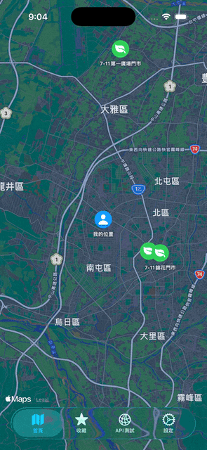

  <a href="README.md">繁體中文</a> |
  <a href="README.en.md">EN</a> |
  <a href="README.ja.md">JP</a> |
  <a href="README.ko.md">KR</a>

  
  
  
  
  
  

## 專案說明

本專案為 SwiftUI 開發的 iOS App，
用於讀取並解析政府開放資料集「綠生活_綠色商店」JSON 檔案，
並將台中市的綠色商店以地圖標記（Map Annotation）方式顯示其所在位置。

App 採用 Swift 的 Codable 機制進行 JSON 解碼，
並結合 MapKit（或 SwiftUI Map）將商店位置呈現在互動地圖上，
使用者可以縮放、平移地圖，並點擊標記查看商店詳細資訊（行政代碼、項次、縣市別、商店名稱、地址、電話等）。

## 使用前注意事項

本 App 採用「前後端分離」架構，  
需搭配本專案提供之 FastAPI 後端服務使用。

請先啟動 FastAPI 後端 (Doc 資料夾)，成功產出 API 服務後，
再執行 iOS App，否則 App 將無法取得綠色商店資料，
地圖上也不會顯示任何標記。

請確認 API 可正常回傳資料後，再開啟 App。

## 小功能展示

  <table>
    <tr>
      <td align="center" style="padding: 0 20px;">
         
        <b>串 API Demo</b>
      </td>
      <td align="center" style="padding: 0 20px;">
         
        <b>顯示綠色商店的環視圖</b>
      </td>
      <td align="center" style="padding: 0 20px;">
         
        <b>顯示使用者到綠色商店的路線</b>
      </td>
      <td align="center" style="padding: 0 20px;">
         
        <b>顯示使用者喜愛的商店</b>
      </td>
    </tr>
  </table>

## 大致功能展示

    <td align="center" style="padding: 0 20px;">
         
    </td>

## 授權
此專案程式碼之授權依本儲存庫之 `LICENSE` 檔案為準。
若未提供，則預設僅供學習與示範使用。

資料集著作權及使用規範依政府開放資料平台之授權條款執行。
